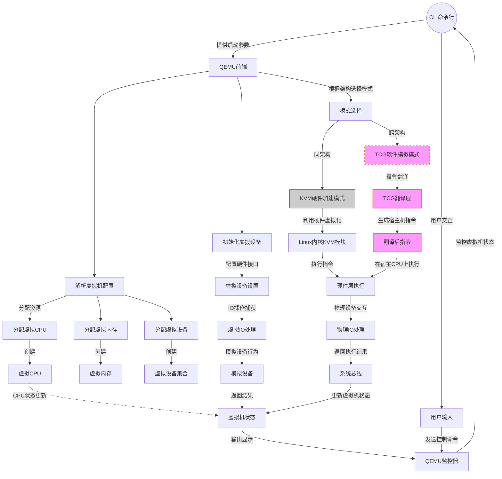

# **跨架构虚拟化概念**

## 是什么

跨架构虚拟化是指在一种处理器架构上虚拟化运行另一种架构的操作系统和应用程序。它允许用户在不同架构的虚拟环境中模拟硬件资源，并执行编译为目标架构（如ARM、PowerPC等）的代码。这种技术特别适用于软件开发、测试、迁移和教育等场景，用户可以在常见的x86架构硬件上模拟其他架构，而无需投资专用硬件。

## 为什么

跨架构虚拟化的应用非常广泛，包括但不限于以下几个方面：

- **软件开发**：开发者可以在x86机器上直接编译、测试、调试为ARM或其他架构设计的软件。
- **教育和研究**：教师和学生可以在个人电脑上模拟和学习不同的计算机架构和系统。
- **应用迁移**：企业可以模拟旧的、不再被支持的硬件平台，以便迁移和现代化遗留应用程序。
- **兼容性测试**：在多架构软件部署之前，确保软件在不同硬件平台上的兼容性和性能。

跨架构虚拟化的优势包括：

- **成本效益**：省去了购买和维护多平台硬件的费用。
- **便捷性**：提供了即时创建、复制和删除虚拟环境的能力。
- **可扩展性**：轻松地扩展虚拟资源以满足不同的测试和开发需求。
- **灵活性**：支持各种操作系统和应用程序的模拟，无论其原始设计架构如何。

## 怎么样

虚拟化技术可以大致分为两类：

- **硬件辅助虚拟化**：利用CPU的虚拟化扩展（如Intel VT-x和AMD-V）直接在硬件上运行虚拟机指令，提供较高的性能和安全性。硬件辅助虚拟化最适合同架构之间的虚拟化。
- **纯软件模拟**：不依赖特定硬件特性，通过软件层模拟CPU和设备的行为。在跨架构虚拟化中，由于宿主机硬件无法直接运行目标架构的指令，必须借助软件模拟来完成这一任务。其中，QEMU就是广泛使用的一种虚拟化模拟软件。

> 在比较两者时，硬件辅助虚拟化通常提供更接近本地执行的性能，但它受限于宿主机和客户机架构的兼容性。而纯软件模拟虽然灵活且能够支持跨架构虚拟化，但通常会带来更大的性能开销。QEMU作为实现跨架构虚拟化的工具，主要采用纯软件模拟的方法，通过其强大的动态二进制翻译技术，使其在x86平台上模拟ARM或其他架构成为可能。尽管存在一定的性能损失，但QEMU为用户提供了在单一硬件平台上体验和交互多种架构的能力，这在很多场景中显得非常宝贵。

---

# **QEMU跨架构虚拟化的核心技术**

## **动态二进制翻译（DBT）技术介绍**

动态二进制翻译是QEMU实现跨架构虚拟化的基石。DBT技术涉及将一种CPU指令集架构（ISA）的指令实时翻译成另一种ISA的指令，从而允许在一种架构的物理硬件上运行为另一种架构设计的软件。

## **Tiny Code Generator（TCG）的作用和原理**

TCG是QEMU中负责DBT的组件。它将来自虚拟CPU的指令序列（例如ARM指令）翻译成与宿主机CPU（例如x86_64）兼容的指令序列。TCG使用一种中间表示（IR）来抽象具体的CPU指令，这使得QEMU能够以统一的方式处理多种不同的CPU架构。TCG按如下流程工作：

1. **取指（Fetch）**：TCG从虚拟机内存中获取ARM指令。
2. **解码（Decode）**：TCG解码ARM指令，理解它的操作（加法）和操作数（R1, R2, R0）。
3. **IR生成（IR Generation）**：将ARM指令翻译成TCG的中间表示（IR）。IR是一种抽象的指令集，与具体CPU架构无关。
4. **IR优化（IR Optimization）**：对IR进行优化，比如合并连续的操作，去除无用代码等。
5. **宿主机指令生成（Host Instruction Generation）**：将优化后的IR翻译成宿主机x86指令。

## 例子

假设有以下ARM汇编代码：

```nasm
LOOP:   CMP     R1, #10        ; 比较R1和常量10
        BEQ     END            ; 如果R1等于10，则跳转到标签END
        ADD     R0, R0, R1      ; 将R0和R1的值相加，结果存放在R0中
        ADD     R1, R1, #1      ; 将R1加1，实现自增
        B       LOOP            ; 无条件跳转到标签LOOP，形成循环
END:    ...                     ; 循环结束后继续执行的代码
```

这个代码片段是一个简单的循环：

如果R1不等于10，它会将R1的值加到R0，并且递增R1的值，然后跳回循环开始继续执行，直到R1等于10。

**IR生成（IR Generation）**：

首先，每条ARM指令都会被转换成TCG的中间表示（IR）。由于指令直接翻译，初始的IR可能包含许多不必要的跳转和比较。

```nasm
label LOOP
    cmp_i32 R1, 10            ; 比较32位整数R1和常量10
    br_eq   R1, 10, END       ; 如果相等，跳转到标签END
    add_i32 R0, R0, R1        ; 对32位整数R0和R1执行加法，结果存入R0
    addi_i32 R1, R1, 1        ; 对32位整数R1加上常量1，结果存入R1
    br      LOOP              ; 无条件跳转回标签LOOP
label END
```

```nasm
seti_i32 loop_counter, 10  ; 设置32位整数循环计数器为10
label LOOP
    sub_i32 loop_counter, loop_counter, 1  ; 循环计数器减1
    brz     loop_counter, END              ; 如果循环计数器为零，跳转到标签END
    add_i32 R0, R0, R1                     ; 对32位整数R0和R1执行加法，结果存入R0
    addi_i32 R1, R1, 1                     ; 对32位整数R1加上常量1，结果存入R1
    br      LOOP                           ; 无条件跳转回标签LOOP
label END
```

**IR优化（IR Optimization）**：

在优化阶段，TCG会尝试简化IR代码，比如通过消除不必要的跳转和合并多个操作来优化性能。在我们的例子中，TCG可能会识别这是一个循环结构，并以更有效的方式重组IR代码，例如引入一个循环计数器或将部分代码展开以减少跳转。

**宿主机x86指令生成：**

我们使用`mov`来初始化循环计数器，`dec`来递减计数器，`jz`来进行条件跳转，`add`和`inc`来执行加法和自增操作。循环通过`jmp`指令实现，它无条件地跳转回循环的开始。对应到原始的ARM代码，`eax`和`ebx`分别对应于R0和R1。

```nasm
mov     ecx, 10           ; 将常量10移动到ecx寄存器，用作循环计数器
LOOP:
    dec     ecx               ; 将ecx寄存器的值减1
    jz      END               ; 如果ecx寄存器的值为零，跳转到标签END
    add     eax, ebx          ; 将eax和ebx寄存器的值相加，结果存放在eax中
    inc     ebx               ; 将ebx寄存器的值加1，实现自增
    jmp     LOOP              ; 无条件跳转回标签LOOP，形成循环
END:
    ...                       ; 循环结束后继续执行的代码
```

## **软件模拟中的性能优化手段**

虽然DBT和软件模拟提供了极高的灵活性和广泛的兼容性，但它们通常会引入比硬件辅助虚拟化更高的性能开销。为了尽可能减少这种开销，QEMU实施了多种性能优化措施：

- **指令缓存**：TCG编译的宿主机指令被缓存起来以供重复使用，这避免了相同的指令序列被多次翻译。
- **静态代码分析**：在编译时分析指令流，以便合并和优化可以一起执行的指令。
- **即时编译（JIT）**：只有在需要执行的时候才对指令进行翻译和编译，这样可以减少不必要的工作量。

---

# **QEMU跨架构虚拟化的流程**




1. **用户创建虚拟机请求**：

    - 用户通过CLI命令行输入QEMU启动命令，包含硬件配置（CPU架构、内存大小、磁盘镜像路径等）和启动参数。
    - 这些参数被作为命令行参数传递给QEMU的主执行文件。

    例子：

    在x86_64宿主机上启动一个AArch64架构的虚拟机：

    ```bash
    qemu-system-aarch64 -machine virt -cpu cortex-a57 -nographic -smp 2 -m 2048 -kernel vmlinuz-aarch64 -initrd initrd.img-aarch64 -append "console=ttyAMA0" -drive if=none,file=disk.img,id=hd0 -device virtio-blk-device,drive=hd0
    ```

    在这个命令中：

    - `qemu-system-aarch64`：是QEMU的AArch64系统模拟器。
    - `-machine virt`：指定QEMU使用的虚拟化机器类型，这里是一个针对虚拟化优化的通用类型。
    - `-cpu cortex-a57`：模拟的CPU类型，这里模拟的是ARM的Cortex-A57处理器。
    - `-nographic`：不显示图形界面，使用控制台输出。
    - `-smp 2`：虚拟机使用2个CPU核心。
    - `-m 2048`：虚拟机分配的内存大小为2048MB。
    - `-kernel vmlinuz-aarch64`：AArch64架构的内核镜像文件。
    - `-initrd initrd.img-aarch64`：初始内存盘（initrd）镜像文件。
    - `-append "console=ttyAMA0"`：内核启动参数，输出到ttyAMA0。
    - `-drive if=none,file=disk.img,id=hd0`：定义一个硬盘驱动，指向你的磁盘镜像文件。
    - `-device virtio-blk-device,drive=hd0`：将磁盘镜像连接到虚拟机上

2. **QEMU前端解析**：

    - 前端（main函数）接收CLI参数，解析这些参数并构建内部的配置对象。
    - 解析命令行参数后，QEMU初始化日志系统，注册设备模型，并设置全局变量。

3. **初始化虚拟硬件**：


    | 设备类型           | 句柄信息描述                                                 |
    | ------------------ | ------------------------------------------------------------ |
    | 虚拟CPU (vCPU)     | 包括寄存器状态、程序计数器、中断状态、以及指向宿主线程的指针。 |
    | 虚拟内存 (vMemory) | 包括虚拟地址空间的起始和结束地址、权限设置、映射到宿主机物理内存的地址。 |
    | 虚拟磁盘 (vDisk)   | 包含虚拟磁盘的容量、格式、以及宿主机上磁盘文件的路径和访问权限。 |
    | 虚拟网卡 (vNIC)    | 包含MAC地址、网络帧过滤设置、以及后端网络模式（如桥接、NAT等）。 |
    | 虚拟图形适配器     | 包含帧缓冲区地址、显示分辨率、颜色深度、以及宿主机上显示输出的配置。 |

    - **分配虚拟CPU（vCPU）**：
        - 为每个vCPU分配内存空间，每个vCPU都对应一个`QEMUThread`，它在宿主操作系统中是一个线程。
        - vCPU的句柄包含CPU架构信息、寄存器状态、执行状态等。
    - **分配虚拟内存（vMemory）**：
        - 创建虚拟内存映射，vMemory的句柄包含内存大小、权限和宿主机上的物理内存映射。
        - 在宿主机上分配实际的内存空间，并为虚拟机内存建立映射。
    - **创建虚拟设备实例与映射**：
        - 虚拟设备的句柄包括设备类型、I/O端口、中断线和后端实现（如磁盘镜像文件）。
        - 设备之间通过总线（bus）相连，总线模拟了硬件上设备的连接方式。

4. **用户空间与内核空间的交互：**

    - **KVM与TCG选择**：
        - 检测宿主机是否支持KVM，如果支持且客户机使用相同架构，则使用KVM模式，否则使用TCG。
        - 在KVM模式下，QEMU将创建KVM虚拟机和虚拟CPU，这些操作通过Linux ioctl系统调用与KVM模块交互。

5. **虚拟机执行与指令翻译：**

    - 启动vCPUs线程，执行虚拟机代码。
    - 如果是KVM模式，vCPUs执行客户机代码几乎不会有中断。
    - 如果是TCG模式，每个vCPU线程通过TCG翻译器翻译指令。

6. **虚拟IO处理：**

    - 设备I/O请求通过QEMU的设备模型层被捕获。
    - 每次虚拟CPU进行I/O操作时，生成的请求被转化为对应设备句柄上的方法调用。

7. **虚拟机状态更新：**

    - 虚拟机的每个组件状态（CPU、内存、设备）都实时更新。
    - QEMU监控器周期性地检查这些状态，并向用户提供反馈。

